# Domain-Specific RAG-Chat Course Helper for 6143-ML

      

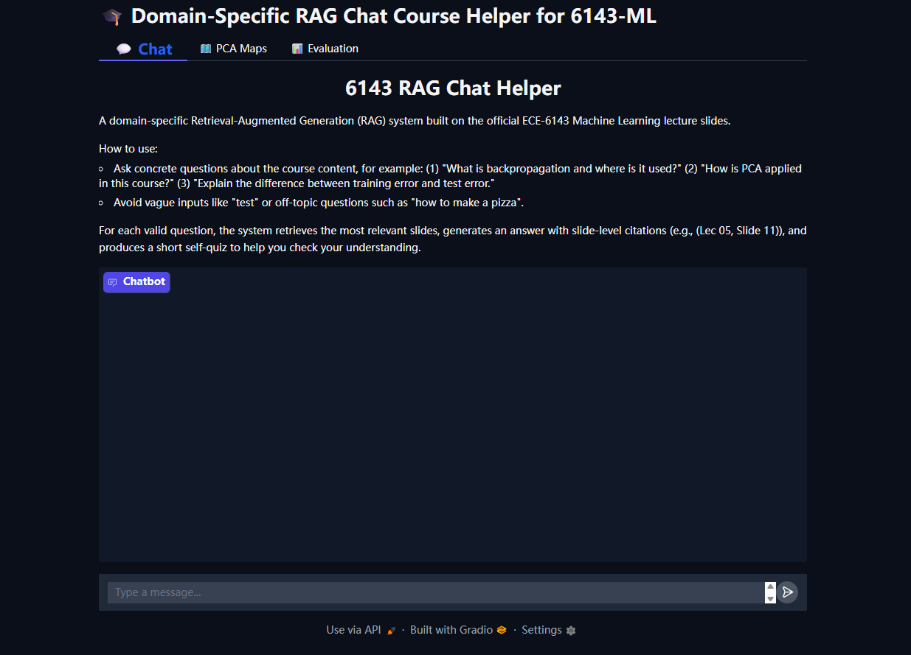

## Table of Contents

1. [Introduction](#1-introduction)
2. [Key Features / Data & Preprocessing](#2-key-features--data--preprocessing)
   - [Input Data: Lecture Slides](#21-input-data-lecture-slides)
   - [One-Slide-One-Chunk Strategy](#22-one-slide-one-chunk-strategy)
   - [Text Cleaning](#23-text-cleaning)
   - [Metadata Design](#24-metadata-design)
   - [Evaluation Metrics](#25-evaluation-metrics)
   - [Quiz Generation](#26-quiz-generation)
3. [Performance](#3-performance)
   - [Retrieval Quality](#31-retrieval-quality)
   - [PCA of Slide Embeddings](#32-pca-of-slide-embeddings)
   - [PCA of Lecture Centers](#33-pca-of-lecture-centers)
4. [System Architecture](#4-system-architecture)
5. [Demo Screenshots](#5-demo-screenshots)
   - [Overall Home UI (Three Tabs: Chat / PCA Map / Evaluation)](#51-overall-home-ui-three-tabs-chat--pca-map--evaluation)
   - [Chat – Simple Question and Self-Quiz Generated with Slide Citations](#52-chat--simple-question-and-self-quiz-generated-with-slide-citations)
   - [Chat – Formula / Derivation Question](#53-chat--formula--derivation-question)
   - [Chat – Off-Topic Question](#54-chat--off-topic-question)
   - [Chat – Invalid / Very Short Query (“test”)](#55-chat--invalid--very-short-query-test)
   - [PCA Map  (With Retry Button) – Slide Embeddings Colored by Lecture](#56-pca-map--with-retry-button--slide-embeddings-colored-by-lecture)
   - [PCA Map (With Retry Button) – Lecture Center Embeddings](#57-pca-map-with-retry-button--lecture-center-embeddings)
   - [Evaluation Tab (With Retry Button) – Recall@K Bar Chart and Metrics](#58-evaluation-tab-with-retry-button--recallk-bar-chart-and-metrics)
6. [How to Run](#6-how-to-run)
   - [Prerequisites](#61-prerequisites)
   - [Get the Project](#62-get-the-project)
   - [(Recommended) Create and Activate a Virtual Environment](#63-recommended-create-and-activate-a-virtual-environment)
   - [Install Python Dependencies](#64-install-python-dependencies)
   - [Vector Index (Already Provided, Optional to Rebuild)](#65-vector-index-already-provided-optional-to-rebuild)
   - [(Optional) Run Retrieval Evaluation](#66-optional-run-retrieval-evaluation)
   - [(Optional) Visualize Embeddings (PCA)](#67-optional-visualize-embeddings-pca)
   - [Launch the Web App](#68-launch-the-web-app)
   - [Use the App (Chat / PCA Map / Evaluation Tabs)](#69-use-the-app-chat--pca-map--evaluation-tabs)


## 1. Introduction

This project is a Retrieval-Augmented Generation (RAG) system built for the NYU 6143 Machine Learning course. It turns the official lecture slides into a lecture-aware assistant that can:

- Answer course-related questions strictly based on the slides.
- Provide slide-level citations (Lec X, Slide Y) for every answer.
- Generate self-quiz questions to support active recall and exam preparation.

**All components run locally:** embeddings are computed with a HuggingFace model, the vector index is stored in FAISS, and answers are generated by a local LLM served via Ollama (no external cloud APIs).

```python
ML_Project/
├── app.py                  
├── rag_pipeline.py         
├── build_index.py          
├── evaluate_retrieval.py 
├── visualize_embeddings.py 
├── config.py               
├── loader.py               
├── embedder.py             
├── indexer.py              
├── requirements.txt   
├── README.md             
├── Slides/
├── Pages/              
├── indexes/                
└── data/                   
```

## 2. Key Features / Data & Preprocessing

### 2.1 Input Data: Lecture Slides

- Source: the official 6143 lecture PDFs (`Lecture1.pdf` … `Lecture15.pdf`).
- Organization: all PDFs are stored under `slides/` and processed in a fixed naming convention.
- Goal: treat the slides as the single source of truth for all QA and quiz generation.

### 2.2 One-Slide-One-Chunk Strategy

- Each PDF page is parsed into plain text and stored as **one chunk per slide**.
- This avoids splitting slide content across multiple chunks and keeps citations simple:
  - Each chunk has a unique `(lecture, slide)` pair.
  - Retrieval results can be directly mapped back to “Lec X, Slide Y”.

### 2.3 Text Cleaning

- Basic cleaning:
  - Remove obvious boilerplate (e.g., repeated headers/footers) when safe.
  - Normalize whitespace and line breaks.
- Conservative policy:
  - Prefer **keeping** noisy text over over-aggressive cleaning that might remove key terms (e.g., “backpropagation”).
  - This was adjusted based on empirical failures where aggressive cleaning caused important keywords to disappear.

### 2.4 Metadata Design

Each slide-chunk is stored with rich metadata to support citation, evaluation, and analysis:

- `source`: original PDF filename (e.g., `Lecture3.pdf`).
- `page`: slide page number within the PDF.
- `lecture`: human-readable lecture identifier (e.g., `Lec 03`).
- Optional fields: anything needed for downstream analysis (e.g., coarse topic tags).

This metadata is used in:

- Context formatting: `"[Source: Lec 03, Slide 11] ..."`
- Answer citations: `(Lec 03, Slide 11)`
- Retrieval evaluation: checking whether the retrieved lecture matches the gold label.

### 2.5 Evaluation Metrics 

To show that retrieval is not “hand-waved”, the project includes a labeled evaluation set:

- Each entry: `{ question, gold_lecture, type, note }`.
- Metrics:
  - **Recall@K**: whether the correct lecture appears in the top-K retrieved slides.
  - Optional hit rate / accuracy by question type (e.g., definition, formula, concept).
- Implementation:
  - `evaluate_retrieval.py` runs retrieval for all labeled questions.
  - Results are saved to a CSV (per-question hits and ranks) and summarized in a Recall@K table.
  - Plots can be generated from this CSV for the **Performance** section.

### 2.6 Quiz Generation

The system generates a self-quiz after each valid lecture-related question:

- Input:
  - The same retrieved context used for answering the question.
  - The user’s question (to align difficulty and topic).
- Output:
  - A single multiple-choice question (A–D), correct answer, and a short explanation.
  - Explanations include at least one citation like `(Lec X, Slide Y)`.
- Safety checks:
  - If the question is clearly not lecture-related (e.g., “test”, “how to make a pizza”) or the model explicitly cannot answer from context, the system does **not** generate a quiz and instead returns a “Self-Quiz: Not available” message.

## 3. Performance

### 3.1 Retrieval Quality


To verify that retrieval is not “hand-waved”, I built a small labeled evaluation set of 15 questions `\data\eval_questions.json`.  Each question is tagged with a gold lecture ID (e.g., `Lec 05`) and is evaluated by whether the correct lecture appears in the top-K retrieved results `\data\retrieval_eval_results.csv`.

| K    | Recall@K |
| ---- | -------- |
| 1    | 0.93     |
| 3    | 1.00     |
| 5    | 1.00     |
| 10   | 1.00     |

- In 14 out of 15 cases, the correct lecture is ranked **first**.  
- For all 15 questions, the correct lecture appears within the top-3 results, and stays there for K=5 and K=10.  

This means the FAISS + `all-MiniLM-L6-v2` pipeline is already strong enough that, for realistic exam-style questions, the system almost always retrieves the right lecture before the LLM even starts generating. 

### 3.2 PCA of Slide Embeddings

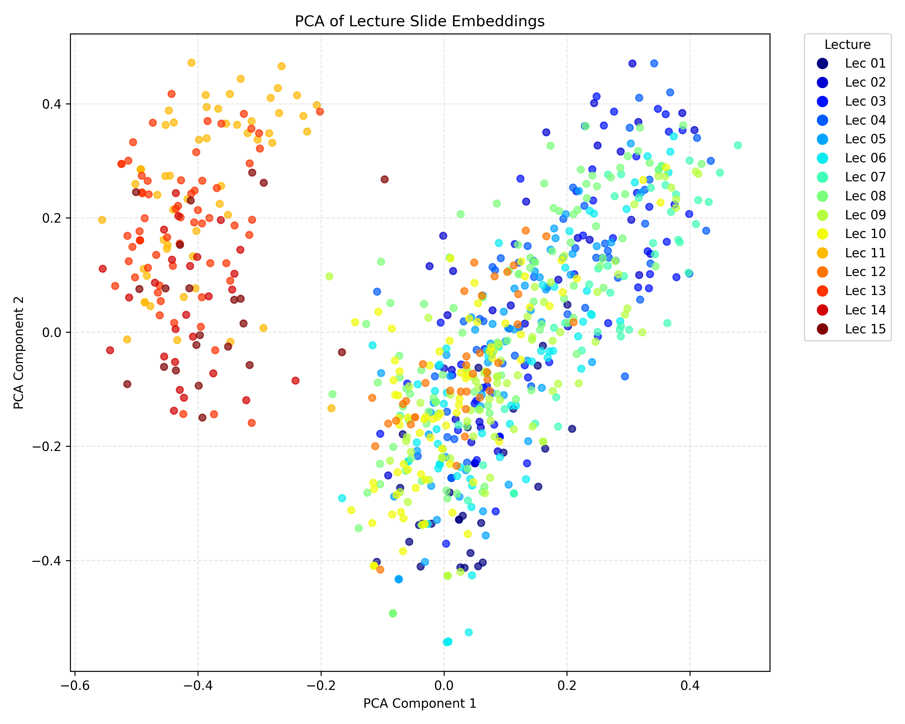

The PCA plot of all slide-level embeddings shows two clear phenomena:

- Slides from the same lecture form compact, coherent clusters in the 2D PCA space, despite being projected down from a much higher-dimensional embedding.  
- Lectures that are conceptually related (e.g., regression-focused lectures in the early part of the course) occupy neighboring regions, while later topics (e.g., clustering, advanced methods) drift into a different region.

This indicates that the `all-MiniLM-L6-v2` embeddings, combined with the one-slide-one-chunk strategy, are capturing both **intra-lecture cohesion** and **inter-lecture semantic structure**.

### 3.3 PCA of Lecture Centers

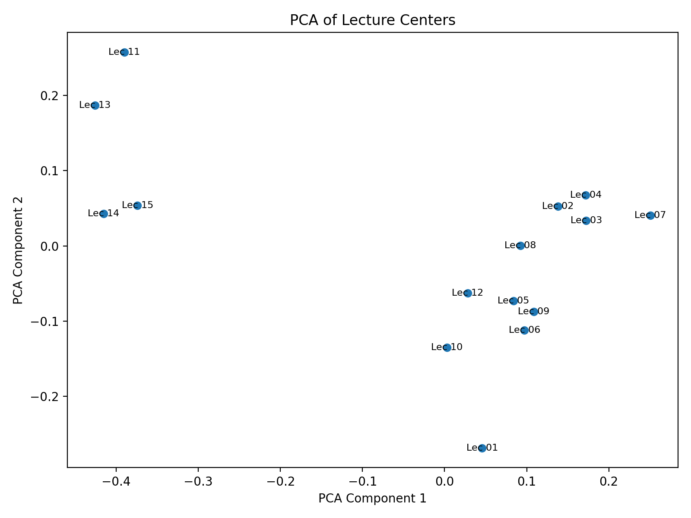

The lecture-center PCA plot (each point is the mean embedding of all slides in a lecture) gives a more “syllabus-level” view:

- Early lectures (Lec 01–10) lie along a relatively smooth trajectory, reflecting the gradual progression from basic regression to more advanced supervised learning concepts.  
- Later lectures (Lec 11–15) form a separate cluster, showing that the model recognizes them as a different thematic block (e.g., unsupervised methods, text/embeddings, or advanced topics).  
- Some lectures, such as Lec 01, appear as clear outliers, which matches the intuition that the intro lecture is structurally different from heavy technical content.

Overall, the geometry of the lecture centers validates that the embedding space encodes **course structure** in a way that is consistent with the instructor’s syllabus. This is exactly what we want for a course assistant: when a student asks about a concept from Lec 05, the system is not just retrieving random slides with similar words, but navigating a well-organized semantic landscape of the entire semester.

## 4. System Architecture


**Indexing pipeline**

1. **Slide Loader & Preprocessing**  
   - Reads all lecture PDFs from `slides/`.  
   - Converts each slide into one text chunk and attaches metadata (`lecture`, `source`, `page`).

2. **Embedding & Index Construction**  
   - Encodes each slide chunk with the HuggingFace `all-MiniLM-L6-v2` model.  
   - Stores vectors and metadata in a FAISS index under `data/`.

**Online QA pipeline**

3. **User Question → Retriever**  
   - A user question comes from the Gradio “Chat” tab.  
   - The retriever queries FAISS and returns the top-K slide chunks with their metadata.

4. **RAG Answer Generation**  
   - The retrieved context is formatted with explicit sources, e.g. `[Lec 05, Slide 11]`.  
   - A local LLM (`deepseek-r1:8b` via Ollama) receives `{question, context, chat_history}` and generates an answer with in-text citations.

5. **Self-Quiz Generation**  
   - Using the same retrieved context, a second LLM call generates one multiple-choice question, its correct option, and a short explanation with citations.  
   - Safety checks (invalid or off-topic questions) disable quiz generation.

6. **Web UI (Gradio Tabs)**  
   - **Chat** tab: shows the conversation and self-quiz.  
   - **PCA Map** tab: displays pre-generated PCA plots of embeddings.  
   - **Evaluation** tab: displays retrieval metrics and plots.

**Analysis pipeline**

7. **Retrieval Evaluation**  
   - A labeled question set (`question, gold_lecture`) is run through the same retriever.  
   - Scripts compute Recall@K and write detailed results to CSV and plots.

8. **Embedding Visualization**  
   - Slide and lecture-center embeddings are projected to 2D via PCA.  
   - Scatter plots illustrate course structure and cluster behavior.

## 5. Demo Screenshots

### 5.1 Overall Home UI (Three Tabs: Chat / PCA Map / Evaluation)


### 5.2 Chat – Simple Question and Self-Quiz Generated with Slide Citations

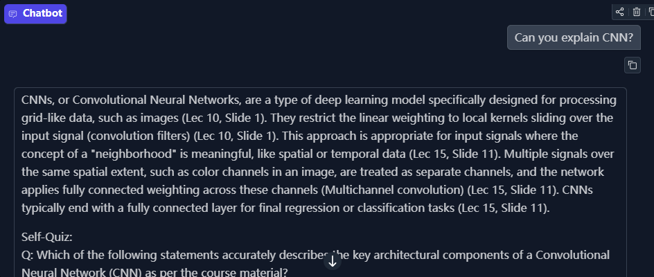

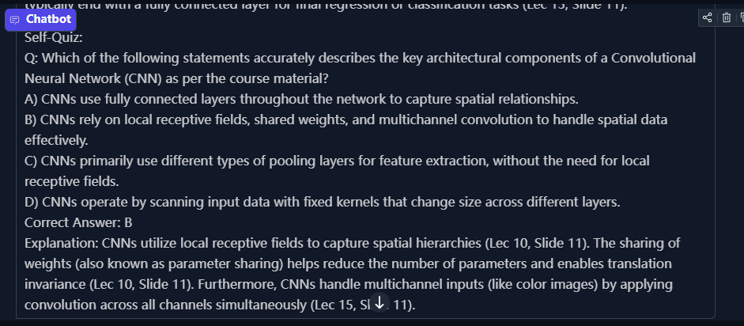

### 5.3 Chat – Formula / Derivation Question

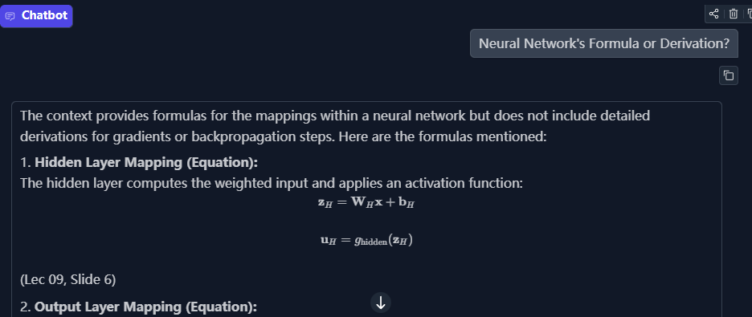

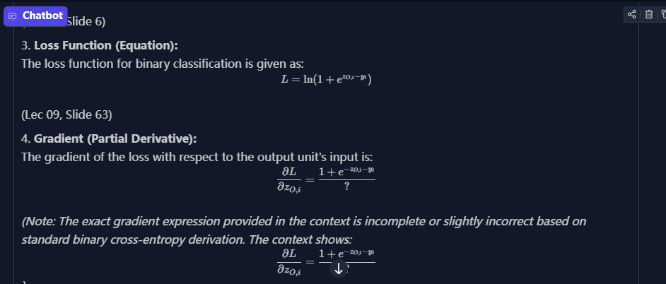

### 5.4 Chat – Off-Topic Question 

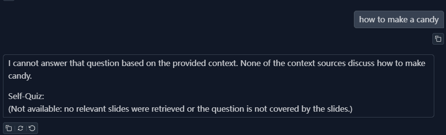

### 5.5 Chat – Invalid / Very Short Query (“test”) 


### 5.6 PCA Map  (With Retry Button) – Slide Embeddings Colored by Lecture

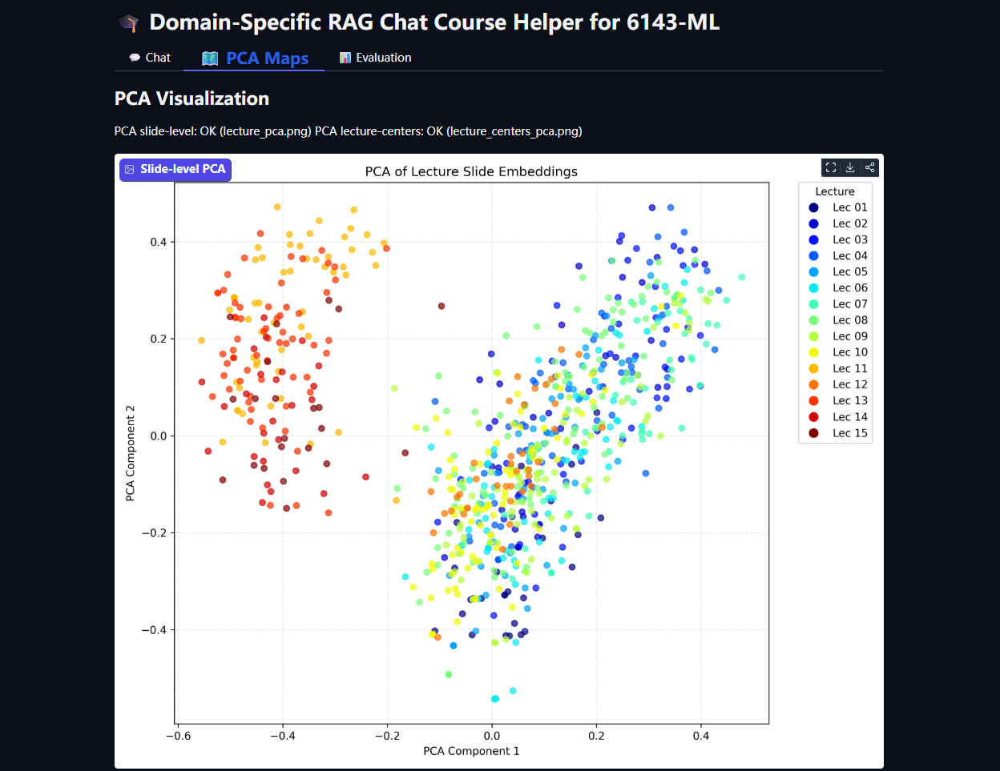

### 5.7 PCA Map (With Retry Button) – Lecture Center Embeddings 

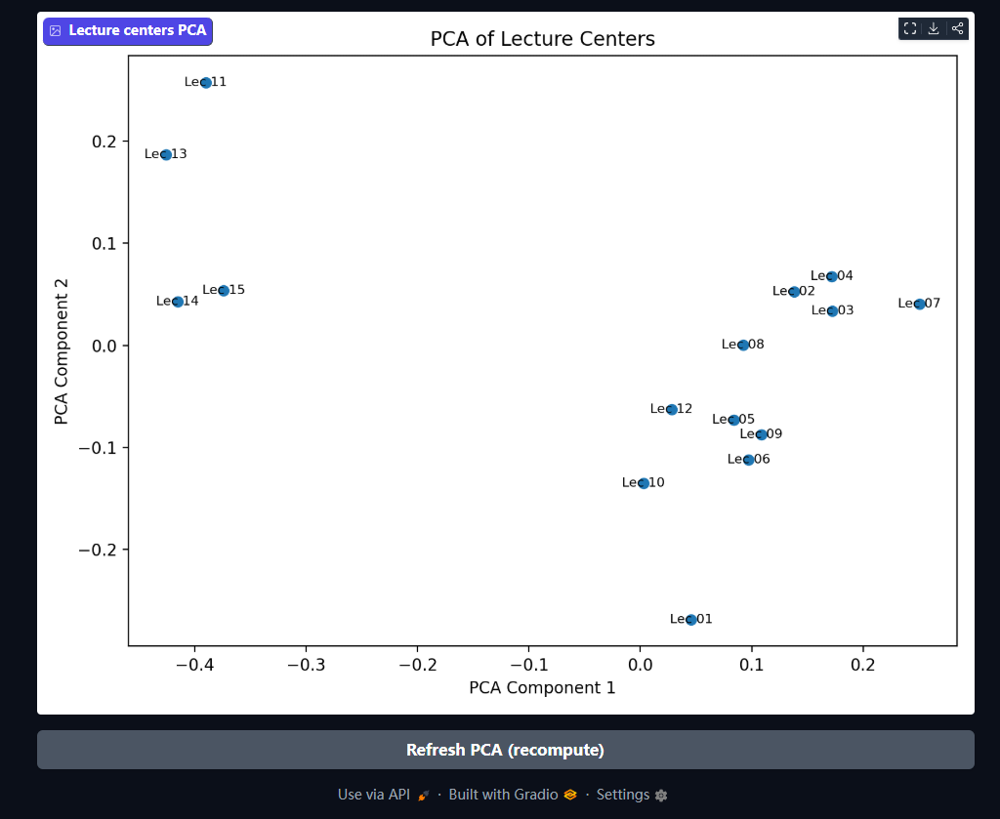

### 5.8 Evaluation Tab (With Retry Button) – Recall@K Bar Chart and Metrics 

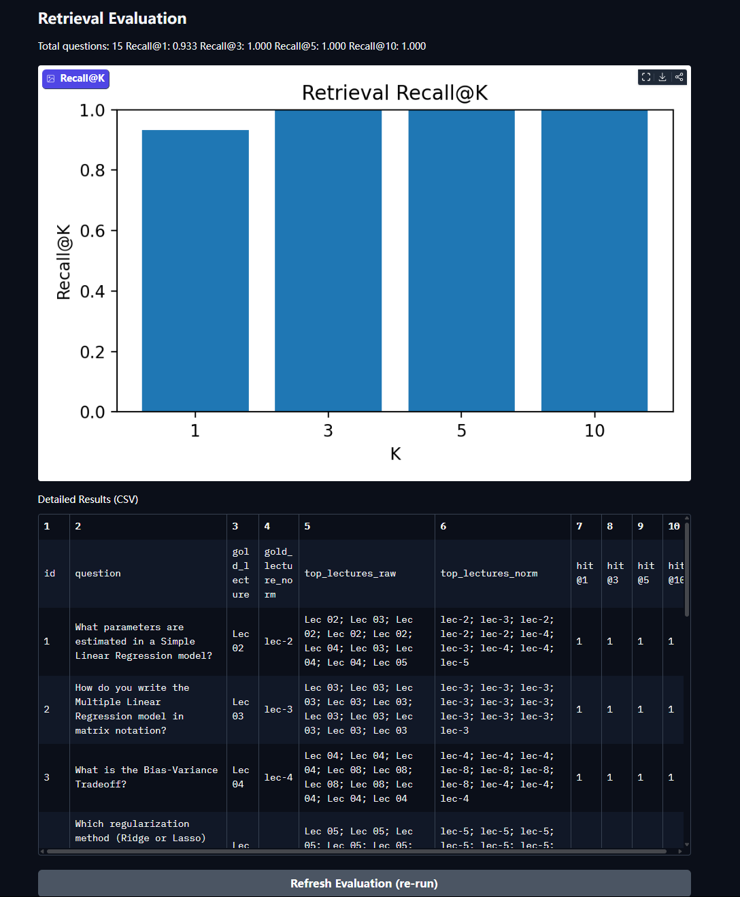

## 6. How to Run

### 6.1 Prerequisites

1. **Python**
   - Recommended: Python 3.10–3.12.

2. **Ollama**
   - [Install Ollama from the official website (macOS / Windows / Linux supported).](https://ollama.com/download)
   - Pull the LLM used in this project (*"Please ensure Ollama is updated to the latest version to support DeepSeek models."*):
     ```bash
     ollama pull deepseek-r1:8b
     ```
   - Every time before running the app, make sure the Ollama server is running, for example:
     ```bash
     ollama serve
     ```
     (or simply open the Ollama app so it runs in the background).

3. **Lecture Slides**
   - The `slides/` directory in this repository **already contains** the lecture PDFs used by the project:
     ```text
     slides/
       Lecture1.pdf
       Lecture2.pdf
       ...
       Lecture15.pdf
     ```
   - If you change the filenames or add/remove slides, please update the configuration accordingly in `config.py`.

---

### 6.2 Get the Project

**Option A:** Clone via Git 
**Option B:** Download ZIP

### 6.3 (Recommended) Create and Activate a Virtual Environment

This step is recommended to avoid conflicts with existing Python packages, but the project can also be run in a global environment if desired.

**On Windows:**

```bash
py -m venv .venv
.\.venv\Scripts\activate
```

**On macOS / Linux:**

```bash
python3 -m venv .venv
source .venv/bin/activate
```

You should see `(.venv)` in your shell prompt after activation.

### 6.4 Install Python Dependencies

Install all Python dependencies from `requirements.txt`:

```
pip install -r requirements.txt
```

On the first run, `sentence-transformers` will automatically download the `all-MiniLM-L6-v2` embedding model from Hugging Face when embeddings are needed.

### 6.5 Vector Index (Already Provided, Optional to Rebuild)

The repository already includes a pre-built FAISS index and related files under the `data/` directory, so **you do not need to rebuild the index** just to run the app. (You can directly skip to **7.8 Launch the Web App** if you do not change the slides.)

If you modify the lecture PDFs (e.g., replace them with new versions or add/remove slides) and want to rebuild the index, run:

```
python build_index.py
```

This script will:

- Load all PDFs from the `slides/` folder.
- Parse each slide into a text chunk with metadata (`source`, `page`, `lecture`).
- Compute embeddings using `all-MiniLM-L6-v2`.
- Build a new FAISS index and overwrite the existing files under `data/`.

### 6.6 (Optional) Run Retrieval Evaluation

To reproduce retrieval metrics like Recall@K:

```
python evaluate_retrieval.py
```

This will read the evaluation dataset configured in the script, run retrieval for each question, and write detailed results `data/retrieval_eval_results.csv`.

### 6.7 (Optional) Visualize Embeddings (PCA)

```
python visualize_embeddings.py
```

This will create and save PCA plots  `data/lecture_pca.png`, `data/lecture_centers_pca.png` 

### 6.8 Launch the Web App

Make sure:

- Your virtual environment is activated.
- Ollama is running and the model `deepseek-r1:8b` has been pulled.

Then start the Gradio app:

```
python app.py
```

On startup, you should see log messages about:

- Loading the embedding model `all-MiniLM-L6-v2`.
- Loading the FAISS index from `data/`.
- Starting the Gradio server.

Gradio will print a Random URL *such as*:

```
Running on local URL:  http://127.0.0.1:7860
```

Open this URL in your browser.

### 6.9 Use the App (Chat / PCA Map / Evaluation Tabs)

1. **Chat**
   - Main lecture-based QA interface.
   - Type a lecture-related question in the input box, for example:
     - `What is backpropagation?`
     - `How is PCA used in this course?`
     - `Explain the difference between training error and test error.`
   - Submit the question.
   - The system will:
     - Retrieve the most relevant slide chunks from the FAISS index.
     - Generate an answer strictly based on the retrieved context, with citations like `(Lec 05, Slide 11)`.
     - Append a **Self-Quiz** section: a multiple-choice question (options A–D), the correct answer, and a short explanation with citations.
2. **PCA Map (With Retry Button)**
   - Displays the PCA visualization of the embedding space using the pre-generated images.
   - You can visually inspect how slides or lectures cluster in embedding space.
3. **Evaluation (With Retry Button)**
   - Shows retrieval evaluation results, such as Recall@K and/or plots generated from `evaluate_retrieval.py`.
   - Allows you to inspect how well the system retrieves the correct lecture for the evaluation questions.

For questions that are clearly off-topic (e.g., “how to make a pizza”) or not meaningful (e.g., “test”), the system will:

- Return a message indicating it cannot answer based on the lecture content, and
- Mark the Self-Quiz section as “Not available” instead of generating a misleading question.

